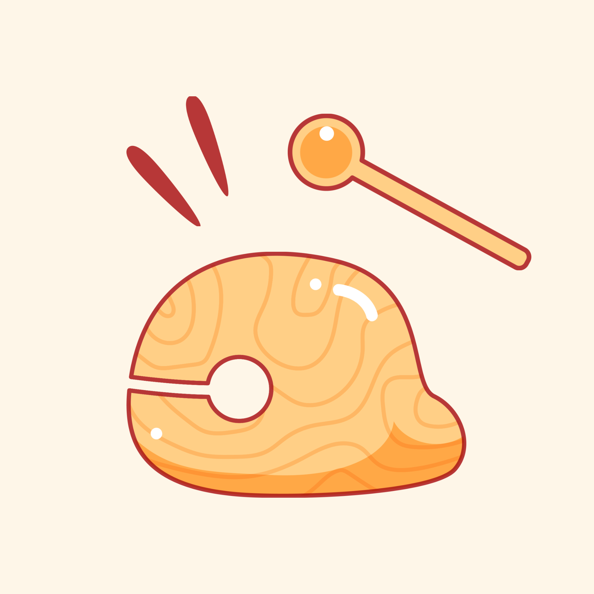
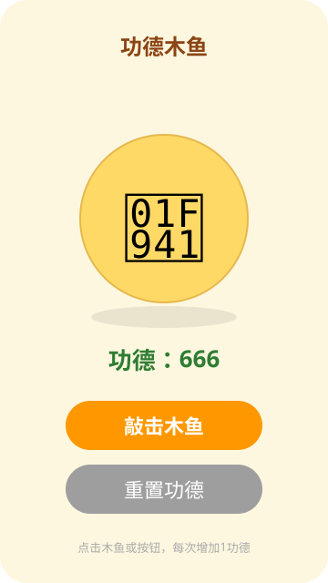

<div align="center">



# 🐟 小鱼小鱼大功德

**一款敲一敲就涨功德的微信小程序（电子木鱼）**

点击木鱼 → 功德 +1 → 音效 + 震动，在手机上体验电子烧香拜佛的快乐

[](https://developers.weixin.qq.com/miniprogram/dev/framework/)
[](https://www.typescriptlang.org/)
[](LICENSE)
[](https://github.com/TmxjTmxj/electronic-muyu/pulls)

</div>

---

## ✨ 功能特性

- 🥁 **点击木鱼，功德 +1** —— 页面中央的金色木鱼，点它就完事
- 🔔 **敲击音效** —— 内置木鱼敲击声（`muyu.mp3`），敲出真实感
- 📳 **震动反馈** —— 支持 `wx.vibrateShort` 轻震，像真的在敲
- 🔄 **一键重置** —— 重置功德带确认弹窗，防误触
- 📱 **单页面极简** —— 全项目 200 行不到，适合入门阅读
- 🪶 **零依赖零后端** —— 纯原生小程序，无云开发、无服务器

## 📸 界面预览

<div align="center">
  
</div>

## 🚀 快速开始

> 前提：安装 [微信开发者工具](https://developers.weixin.qq.com/miniprogram/dev/devtools/download.html)，注册小程序账号

```bash
git clone https://github.com/TmxjTmxj/electronic-muyu.git
cd electronic-muyu
```

1. 打开**微信开发者工具** → 导入项目 → 选择 `electronic-muyu` 目录
2. 本项目已将 `project.config.json` 中的 `appid` 替换为 `touristappid`（游客模式）
3. 直接编译即可在模拟器运行；如需**真机预览 / 上传发布**，请把 `appid` 改成你自己的

> 💡 `project.private.config.json`（开发者工具自动生成的个人配置）已被 `.gitignore` 排除，不会提交到仓库，本地改动互不干扰。

## 📁 项目结构

```
electronic-muyu/
├── assets/                  # 图标与预览素材
│   ├── icon.png             # 小程序图标
│   └── mockup.svg           # README 界面预览图
├── miniprogram/             # 小程序源码
│   ├── app.js               # 应用入口
│   ├── app.json             # 全局配置（页面注册 / 窗口样式）
│   ├── app.wxss             # 全局样式
│   ├── sitemap.json         # 微信索引配置
│   ├── pages/
│   │   └── index/           # 唯一页面：功德木鱼
│   │       ├── index.js     # 敲击逻辑：计数 / 音效 / 震动 / 重置
│   │       ├── index.wxml   # 页面结构
│   │       ├── index.wxss   # 页面样式
│   │       └── index.json   # 页面配置
│   └── sounds/
│       └── muyu.mp3         # 木鱼敲击音效
├── typings/                 # 微信 API TypeScript 类型定义
├── project.config.json      # 开发者工具项目配置（appid 已脱敏）
├── package.json
└── tsconfig.json            # TypeScript 严格模式配置
```

## 🛠️ 技术栈

| 类别 | 技术 |
| ---- | ---- |
| 框架 | 微信小程序原生框架（无第三方 UI 库） |
| 语言 | JavaScript（TypeScript 模板 + 严格模式 tsconfig） |
| 音效 | `wx.createInnerAudioContext` 播放本地 mp3 |
| 反馈 | `wx.vibrateShort` 轻震动 |
| 依赖 | 零 npm 运行时依赖，typings 全部内置 |

## 😂 审核踩坑记

> 开发两小时，审核两天，还接到了审核员的电话。

- 原定名 **「电子木鱼」** 提交审核 → 被判定 **涉嫌宗教** 驳回
- 审核员**亲自打电话**来沟通（人生第一次和审核员通电话）
- 一番友好协商后，改名 **「小鱼小鱼大功德」** 顺利过审上线 🎉
- 经验教训：
  - 小程序命名要远离敏感词——宗教、医疗、金融、政治类词汇都会被重点关照
  - 名字被拒别硬刚，换一个安全的、和功能弱相关的名字是最快的解法
  - 审核电话打来不用慌，态度诚恳沟通，基本都能解决

## 🗺️ Roadmap（欢迎 PR）

- [ ] 功德持久化（`wx.setStorageSync`，重启不丢功德）
- [ ] 敲击动效（木鱼晃动 / 「功德 +1」飘字）
- [ ] 连续敲击音效优化（复用 AudioContext 实例）
- [ ] 分享卡片 + 功德排行榜
- [ ] 更多音效皮肤（木鱼 / 钟 / 钵）

## 📄 License

[MIT](LICENSE) © 2026 TmxjTmxj
